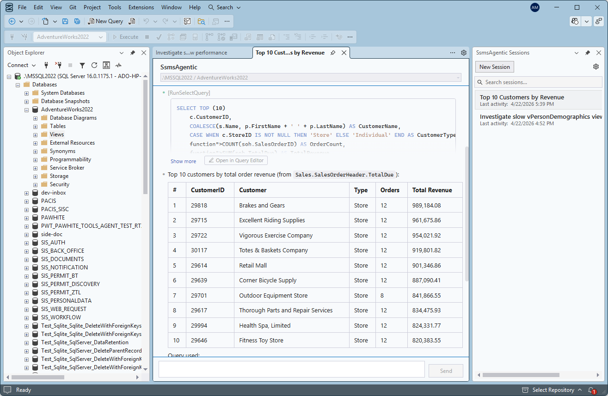
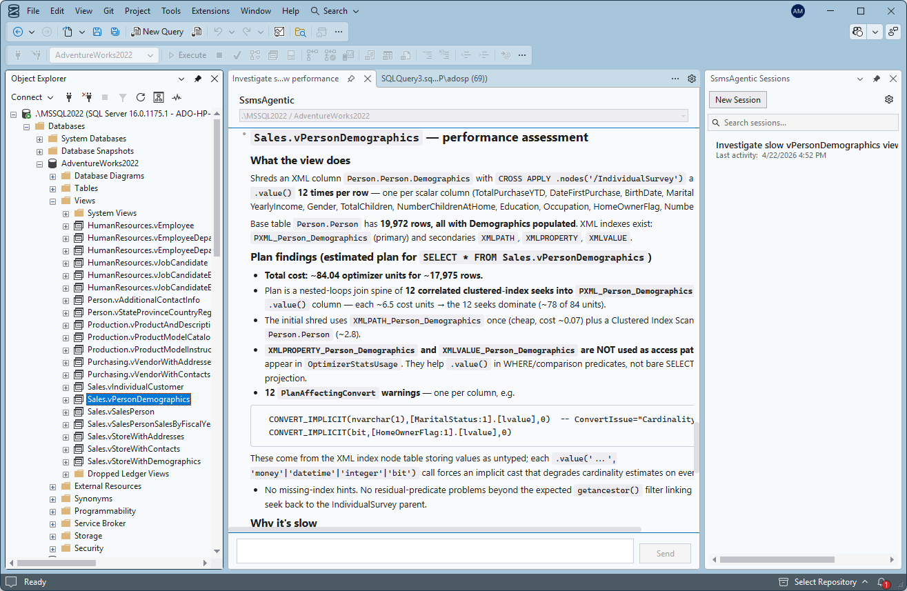
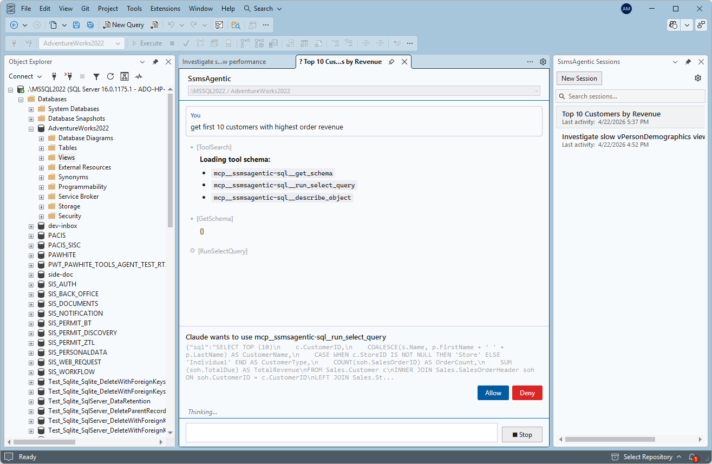

# SsmsAgentic

A Claude-powered AI assistant for **SQL Server Management Studio 22**. SsmsAgentic docks a chat pane inside SSMS and uses the locally installed [Claude Code CLI](https://code.claude.com/docs/en/quickstart) to inspect schemas, generate and explain T-SQL, run queries through SSMS's native pipeline, and carry out multi-step agentic work — all on the connection you already have open, with per-statement approval.

[](https://learn.microsoft.com/en-us/ssms/) [](https://github.com/ado-webco/ssms-agentic/releases) 

[**ssmsagentic.io**](https://ssmsagentic.io) · [Install](https://ssmsagentic.io/getting-started.html) · [Docs](https://ssmsagentic.io/docs.html) · [Compare with Copilot & MCP](https://ssmsagentic.io/ai-for-sql-server.html)



> **15-day free trial.** Distributed under a commercial license with a 15-day trial; the clock starts the first time you open the chat pane in SSMS. For pricing and licensing terms, see [ssmsagentic.io](https://ssmsagentic.io).

## What it does

- **Chat with Claude inside SSMS** — a dockable tool window, accessible from the **Tools** menu.
- **Reuses your live SSMS connection** — server, database, and auth (including Entra interactive and managed identity) are taken from the active SSMS session. No connection strings, no stored credentials.
- **Schema-aware tools** — Claude can inspect tables, views, columns, indexes, and types via MCP tools.
- **Native SSMS execution** — queries run through SSMS's own pipeline, results render in the standard grid and messages pane.
- **Per-statement approval** — every read and write is shown verbatim with an Allow / Deny banner before it executes; writes are highlighted; a full audit log is written to disk.
- **Plan and DMV analysis** — reads execution plans, statistics, and waits to find the actual bottleneck and propose index, statistics, or query changes.
- **Open in Query Editor** — every SQL statement Claude proposes or runs gets a one-click button to open it in a native SSMS query editor tab against your current connection.



## What you can ask

Concrete prompts that map to day-to-day SSMS work:

- *"Find the 10 slowest queries running on this server right now and rank them by total CPU."*
- *"Explain what the `dbo.uspGetBillOfMaterials` stored procedure does, in plain English."*
- *"Get the top 10 customers by order revenue this quarter."*
- *"Read the execution plan for the query in tab 2 and tell me why it's slow."*
- *"Audit logins and roles in this database — flag SA usage, wide-open schemas, and stale accounts."*
- *"Draft a migration that splits `Customers.FullName` into `FirstName` and `LastName` without breaking existing rows."*

Every generated statement waits for your approval before it touches the database.



## SQL tools available to Claude

| Tool | Description |
|---|---|
| `get_schema` | List tables and views with optional database/schema filters |
| `describe_object` | Return columns, types, and metadata for a table or view |
| `run_select_query` | Execute read-only SELECT queries (capped row limit) |
| `run_mutation_query` | Execute INSERT/UPDATE/DELETE/DDL with user approval |
| `explain_query` | Return estimated execution plan (SHOWPLAN_XML) without executing |

All SQL operations are validated using SQL Server's ScriptDom AST to enforce read/write boundaries.

## Requirements

- **SQL Server Management Studio 22** (SSMS 22)
- **Claude Code CLI** installed and authenticated — see below
- Windows (amd64)

## Setting up the Claude CLI

SsmsAgentic launches the [Claude Code CLI](https://code.claude.com/docs/en/quickstart) as a child process, so SSMS must be able to find `claude` on the system `PATH`. The native Windows installer adds it for you automatically.

1. **Install [Git for Windows](https://git-scm.com/downloads/win)** if you don't already have it — the native Claude installer depends on it.
2. **Install the CLI.** Open a terminal (no admin needed) and run one of the official one-liners:

   PowerShell:
   ```powershell
   irm https://claude.ai/install.ps1 | iex
   ```
   Command Prompt:
   ```
   curl -fsSL https://claude.ai/install.cmd -o install.cmd && install.cmd && del install.cmd
   ```
   Other install methods (WinGet, Homebrew, WSL) are listed in the [official quickstart](https://code.claude.com/docs/en/quickstart).
3. **Verify it's on `PATH`.** Open a *new* terminal so it picks up the updated environment, then run:
   ```
   claude --version
   ```
4. **Authenticate.** Run `claude` once and follow the prompts to sign in. SsmsAgentic uses the same credentials.
5. **Restart SSMS.** SSMS reads `PATH` only at process start, so any already-running instances need to be closed and reopened after the install. If the chat pane reports that `claude` cannot be found, this is almost always the cause.

## Installation

The easiest path is the signed Setup.exe at [ssmsagentic.io/getting-started.html](https://ssmsagentic.io/getting-started.html) — it bundles Git, the Claude CLI, WebView2, and the extension into one one-click install.

To install the VSIX directly:

1. Download the latest `.vsix` from the [Releases](https://github.com/ado-webco/ssms-agentic/releases) page.
2. Close SSMS if it's running.
3. Double-click the `.vsix` to install, or run from the command line:
   ```
   "C:\Program Files\Microsoft SQL Server Management Studio 22\Release\Common7\IDE\VSIXInstaller.exe" /q SsmsAgentic.SsmsExtension.vsix
   ```
4. Launch SSMS and find **SsmsAgentic** under the **Tools** menu.

## Updating

Download the new `.vsix` from [Releases](https://github.com/ado-webco/ssms-agentic/releases) and install it. The installer replaces the previous version automatically.

To uninstall:

```
"C:\Program Files\Microsoft SQL Server Management Studio 22\Release\Common7\IDE\VSIXInstaller.exe" /q /u:SsmsAgentic.SsmsExtension.4a8e7b12-9c3d-4e5f-a1b2-c7d8e9f0a1b2
```

## How does this compare to GitHub Copilot in SSMS or Microsoft's SQL MCP Server?

They solve different problems. GitHub Copilot in SSMS is great for inline T-SQL completion while you write queries by hand. Microsoft's SQL MCP Server is plumbing for *building* agents and apps against a database. SsmsAgentic is the only one of the three that is agentic *inside* SSMS — it runs queries for you, reads plans, audits permissions, and proposes changes, with per-statement approval, using the Claude subscription you already have. Side-by-side at [ssmsagentic.io/ai-for-sql-server.html](https://ssmsagentic.io/ai-for-sql-server.html).

## How it works

SsmsAgentic hosts the [Claude Code CLI](https://code.claude.com/docs/en/quickstart) as a child process, communicating over its stream-json protocol. SQL tools are exposed to Claude via an MCP (Model Context Protocol) server that routes queries back through SSMS's own connection, so the same authentication and server context you're already using applies to every query Claude runs. All tool calls require your approval — Claude proposes actions, you decide what runs.

## Feedback and issues

Found a bug or have a feature request? Open an issue on the [issue tracker](https://github.com/ado-webco/ssms-agentic/issues).

## License

Proprietary — use of the SsmsAgentic extension is governed by the EULA at [ssmsagentic.io/terms.html](https://ssmsagentic.io/terms.html). The source code for the extension is not published in this repository.
